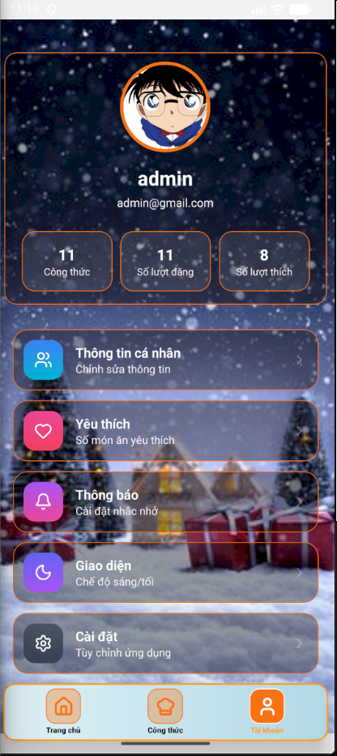

# MyRecipeApp - Cộng Đồng Chia Sẻ Công Thức Nấu Ăn
MyRecipeApp là ứng dụng di động giúp người dùng khám phá, chia sẻ và tương tác thông qua các công thức nấu ăn ngon mỗi ngày. Dự án tập trung vào trải nghiệm người dùng mượt mà với giao diện Giáng Sinh độc đáo và hệ thống quản lý dữ liệu thời gian thực.

## Giao diện chính
- Home: Hiển thị hồ sơ cá nhân rút gọn và ba phần giao diện nhỏ gồm trang cộng đồng , yêu thích và gợi ý món ăn.

- My Recipe: Thiết kế dạng Card/Grid dễ nhìn, giúp người dùng quản lý các món ăn tự sáng tạo một cách khoa học và đẹp mắt.

- Account : Bao gồm Avatar, thống kê nhỏ của bản thân , các tiện ích nhỏ khác nhau bên dưới như thay đổi thông tin người người dùng ,... và nút đăng xuất tài khoản.

## Tính năng chính
### Đăng nhập/Đăng ký
- Đăng ký và đăng nhập nhanh chóng bảo mật , giao diện thuận mắt.

- Xác thực dữ liệu đầu vào, thông báo lỗi thân thiện qua Toast Message.
### Cộng đồng
- Chia sẻ: Đưa công thức cá nhân lên Newsfeed chỉ với một nút bấm. 

- Khám phá Xem danh sách các món ăn từ người dùng khác trên toàn thế giới.

- Thanh tìm kiếm thông minh và lọc món ăn theo danh mục.

- Tương tác: Thả tim/Like bài viết.

- Bình luận (Comments) thời gian thực.

- Đánh giá sao (Rating) tự động cập nhật trung bình.

### Cá nhân
- Lưu trữ công thức của bản thân danh chóng và có thể nút tìm kiếm nhanh chóng dễ dàng.

- Cá nhân hóa: Chỉnh sửa hồ sơ, cập nhật ảnh đại diện ,...

- Có phần gợi ý món ăn từ khắp nơi trên thế giới.

## Công nghệ sử dụng
Frontend: TypeScript (TSX), React Native CLI.

Backend: TypeScript (TS), Firebase (Auth, Firestore), Supabase.

Styling: Linear Gradient, Animated API, Lucide Icons, React Native Paper, React Native Toast(thông báo).

Quản lý trạng thái: React Hooks (useState, useEffect, useCallback).

Dịch vụ khác: React Native Image Picker, RN-Blob-Util, ...

# Cài đặt ứng dụng
## Clone dự án
git clone https://github.com/Nghmin/MyRecipeApp.git

## Cài đặt thư viện
npm install

## Chạy trên Android
npx react-native run-android

## Chạy trên iOS
npx react-native run-ios

# Liên hệ
github: https://github.com/Nghmin.
