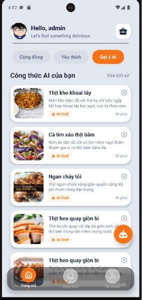
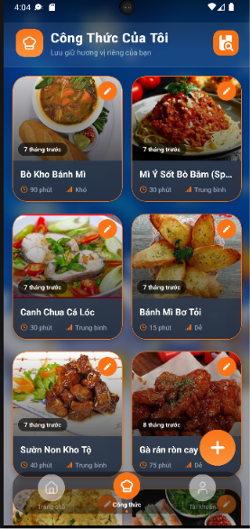
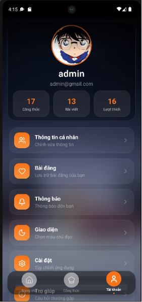

# My Chef App - Trợ Lý Nấu Ăn Thông Minh Tích Hợp AI 

**My Chef App** là ứng dụng di động hiện đại giúp người dùng quản lý công thức nấu ăn và sáng tạo món ngon mỗi ngày thông qua sức mạnh của trí tuệ nhân tạo. Ứng dụng kết hợp giữa kho lưu trữ cá nhân tiện lợi và mạng xã hội chia sẻ ẩm thực thời gian thực.

## Tính năng nổi bật

### Trí Tuệ Nhân Tạo (Generative AI)
- **Gợi ý món ăn thông minh:** Tích hợp **Google Gemini Flash API** để phân tích danh sách nguyên liệu có sẵn và tự động sinh ra công thức nấu ăn chi tiết.
- **Tối ưu hóa dữ liệu:** Sử dụng kỹ thuật Prompt Engineering để ép kiểu dữ liệu trả về theo chuẩn JSON, đảm bảo hiển thị mượt mà trên giao diện mobile.

### Cộng Đồng Ẩm Thực (Real-time Feed)
- **Chia sẻ tức thì:** Đưa công thức cá nhân lên bảng tin cộng đồng chỉ với một chạm.
- **Tương tác thời gian thực:** Like, Bình luận và Đánh giá món ăn được cập nhật ngay lập tức thông qua **Firebase Cloud Firestore Listeners**.
- **Hệ thống thông báo:** Nhận thông báo tức thì khi có tương tác mới hoặc công thức mới từ cộng đồng.
- **Cơ chế Snapshot:** Áp dụng kỹ thuật phi chuẩn hóa dữ liệu để bảo toàn nội dung bài đăng cộng đồng ngay cả khi công thức gốc bị chỉnh sửa.

### Cá Nhân Hóa & Hiệu Năng (UX/UI & Performance)
- **Dynamic Theme:** Hệ thống thay đổi giao diện động (Sáng/Tối/Tùy chỉnh màu sắc) toàn cục dựa trên **React Context API**.
- **Tối ưu hóa Android:** Xử lý triệt để lỗi hệ thống tệp tin (**ENOENT**) trên Android bằng quy trình chuẩn hóa đường dẫn (Path normalization) và mã hóa **Base64** để upload ảnh ổn định lên Supabase Storage.

## Công nghệ sử dụng
- **Frontend:** React Native CLI, TypeScript (TSX).
- **AI Integration:** Google Gemini Flash API.
- **Backend & Cloud (BaaS):** Firebase (Auth, Firestore), Supabase (Storage).
- **State Management:** Context API, React Hooks (useEffect, useCallback, useMemo).
- **Styling & UI:** Linear Gradient, Lucide Icons, React Native Paper, Vector Icons.
- **Utilities:** RN-FS (File System), Image Picker, Dotenv.

## Giao diện ứng dụng
| Màn hình chính | Kho công thức | Tài khoản |
|:---:|:---:|:---:|
|  |  |  |

## Hướng dẫn cài đặt

1. **Clone dự án:**
   ```bash
   git clone https://github.com/Nghmin/MyRecipeApp.git
   ```
2. **Cài đặt thư viện:**
   ```bash
   npm install
   ```
3. **Cấu hình môi trường:**
   Tạo file `.env` tại thư mục gốc và cấu hình các khóa API:
   ```env
   GEMINI_API_KEY=your_gemini_key
   SUPABASE_URL=your_supabase_url
   SUPABASE_ANON_KEY=your_supabase_key
   ```
4. **Chạy ứng dụng:**
   ```bash
   npx react-native run-android
   ```

